# Amazon_Vine_Analysis

## Overview of Analysis
* The purpose of this analysis was to determine if there is any bias toward favorable reviews from Amazon Vine members. To determine this, I selected one of the 50 Amazon review datasets (stored on S3) we were granted access to. Then, I created an AWS RDS DB instance and selected PostgresSQL as the host engine. From there, I accessed the PostgresSQL DB instance through pgAdmin and created four tables. After that, I used PySpark to load in the Amazon dataset from S3 into my Google Colab notebook. Then, I used PySpark to parse the data and create four different dataframes and loaded each of them to their appropriate table within the DB instance being hosted by AWS RDS, which I previously created in pgAdmin. 
---
## Results
* Since the original dataset was then split up into four different dataframes / tables (within pgAdmin), and I modified the DB's security settings to allow for public access, it would have been possible for anyone I granted permission to, to access this DB via pgAdmin (e.g. my colleagues, if needed). However, I chose to perform the queries necessary to identify any positivity bias from my dataset using PySpark. Therefore, I used the 'vine_table' (as it is referenced in the instructions) dataframe (DF) ... which I named 'vine_df', (the 'vine_df' was created by simply filtering the original dataset for the 'review_id', 'star_rating', 'helpful_votes', 'total_votes', 'vine', and 'verified_purchase' columns) to perform the following queries:
1. Filter the data and create a new DataFrame or table to retrieve all the rows where the total_votes count is equal to or greater than 20 to pick reviews that are more likely to be helpful and to avoid having division by zero errors later on: 
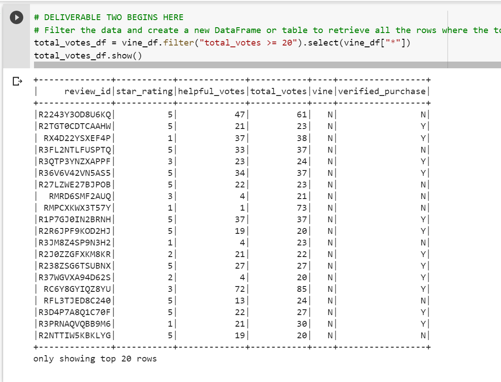
2. Filter the new DF made from the step above to retrieve all the rows where the number of helpful_votes divided by total_votes is equal to or greater than 50% to improve the quality of our dataset:
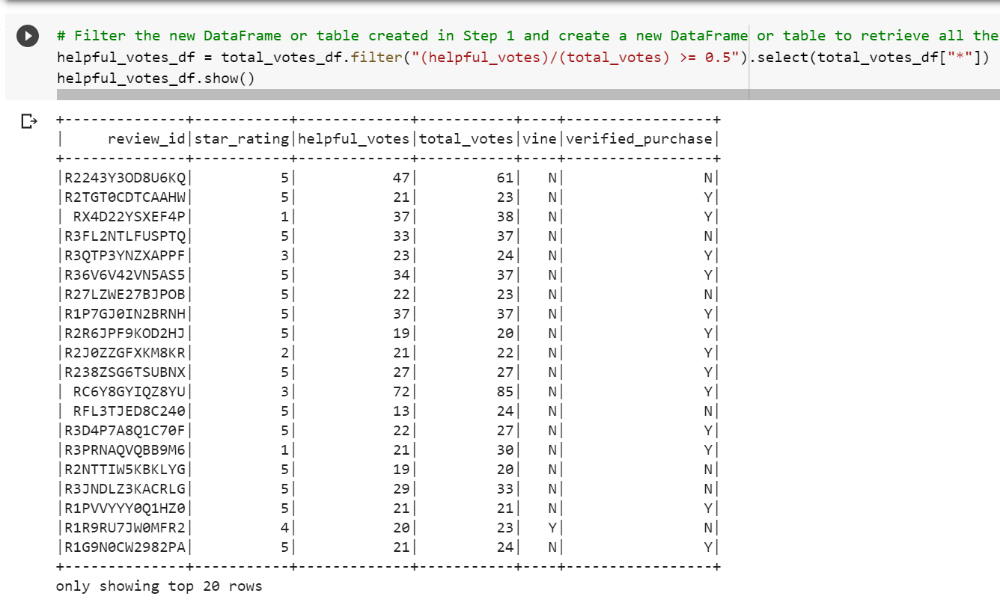
3. Filter the DF created in the above step to create a new DF that only contains the reviews made by Amazon Vine members: 
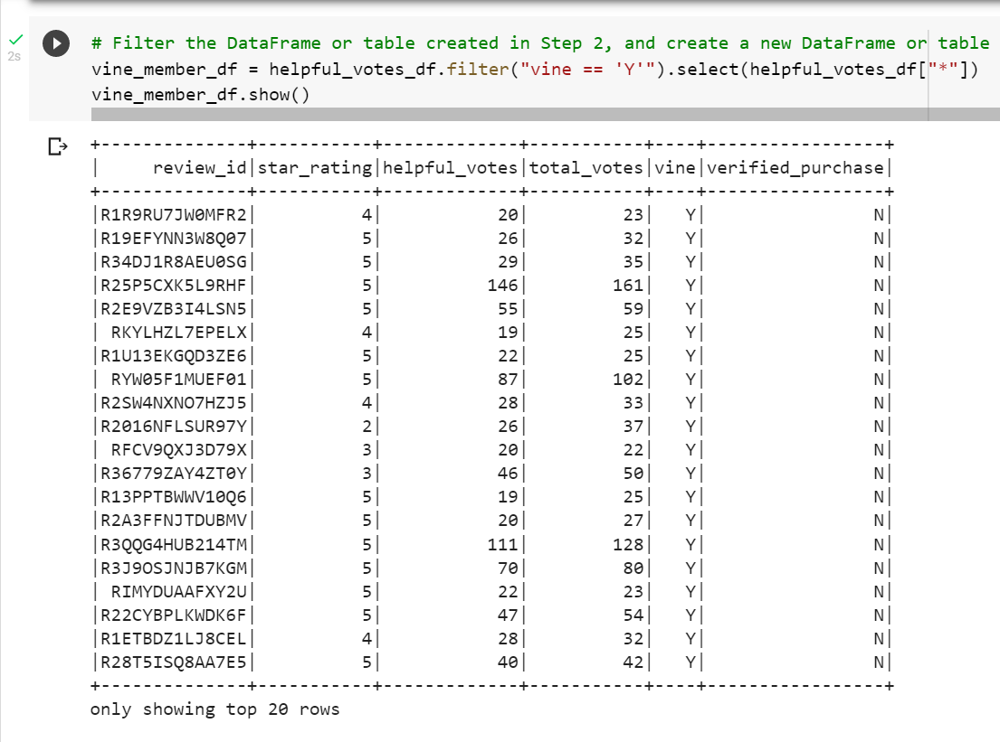
4. Filter the DF created from step 2 to create a new DF that only contains the reviews made by NON-Amazon Vine members:
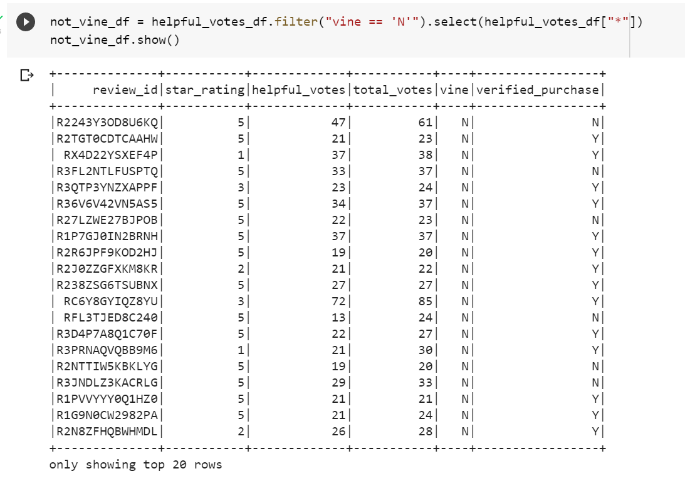
5. Execute a function on the DF created from step 2 that will count the total number of reviews within this DF (which will be used as our denominator when determining our percentages that will indicate/not indicate the bias we are looking for):
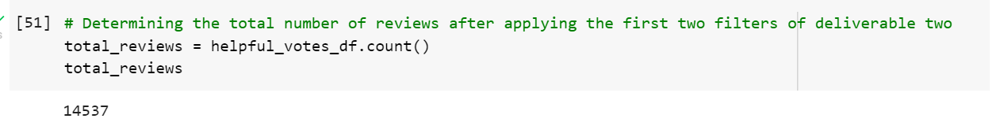
6. Creating a new DF from the DF created in step 2 that only includes the reviews that possess a five-star rating:
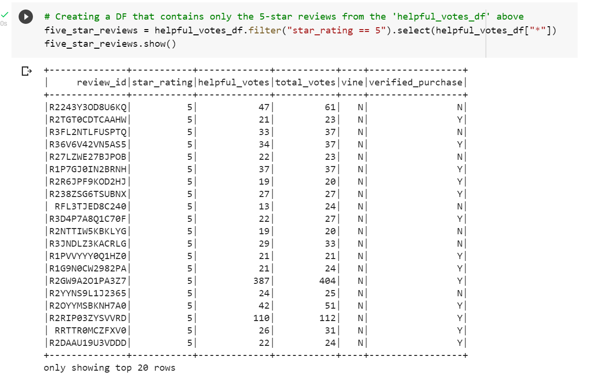
7. Execute a function on the DF created in the above step that calculates the total number of reviews it holds (the total # reviews from the DF created in step 2 that possess a five-star rating)
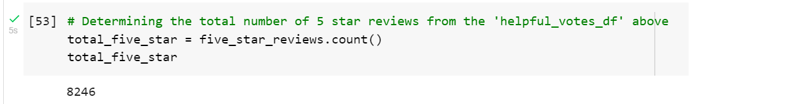
8. Create a new DF that filters the DF created in step 6 so that it only includes the five-star reviews written by Amazon Vine members
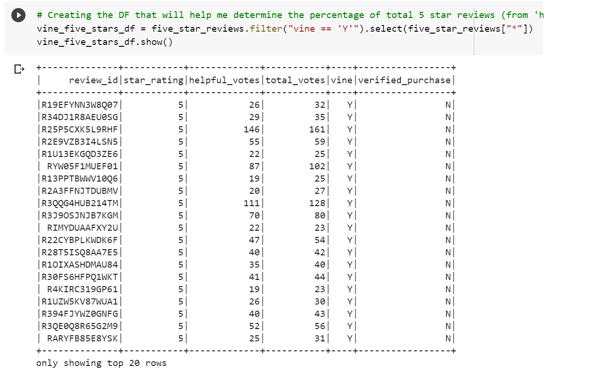
9. Executing a function that will count the number of reviews included in the DF created from the step above:
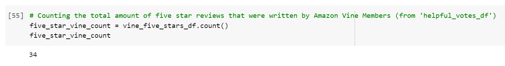
10. Create a new DF that filters the DF created in step 6 so that it only includes the five-star reviews that were NOT written by Amazon Vine members:
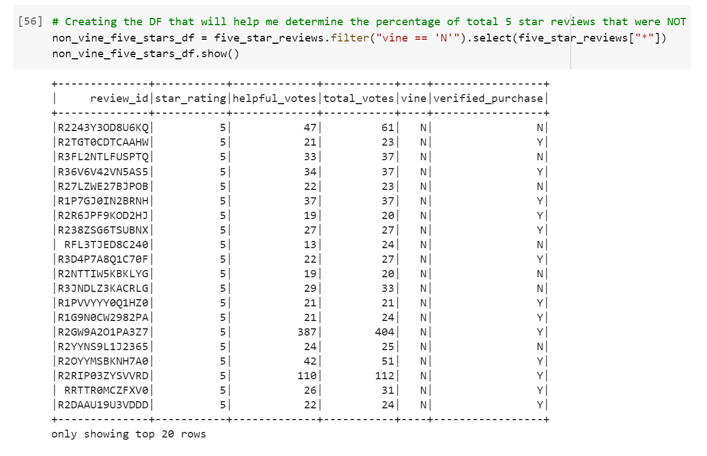
11. Executing a function that will count the number of reviews included in the DF created from the step above:
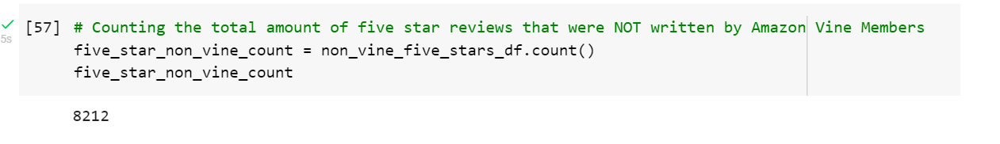
12. And finally, I executed two functions that calculated the percentage of five-star reviews from the DF created in step 2 that were written by Amazon Vine members and that were NOT written by Amazon vine members:
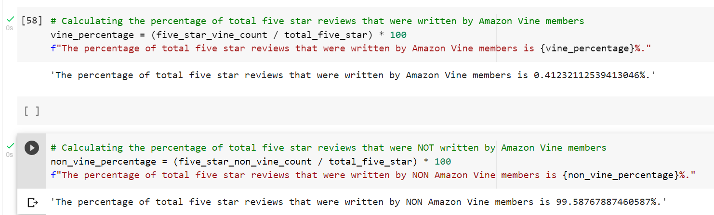
---
## Summary
* As shown above, the percentage of 5-star reviews that were written by non Amazon Vine members far surpasses the percentage of 5-star reviews written by Amazon Vine members, which thereby suggests that there is no positivity bias coming from reviews made by Amazon Vine members. One additional analysis I could do with the dataset to support my statement is to compare these results with identical analyses conducted on other Amazon product-category datasets. 

